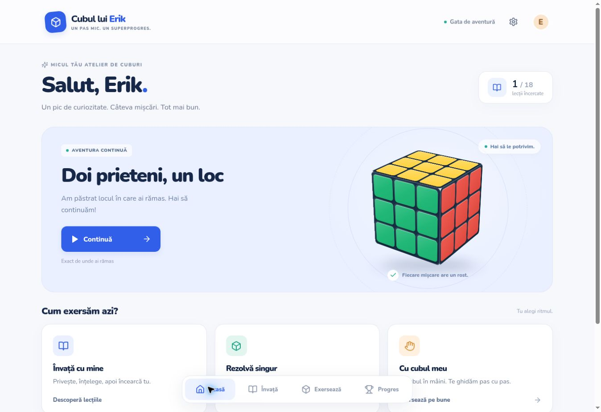
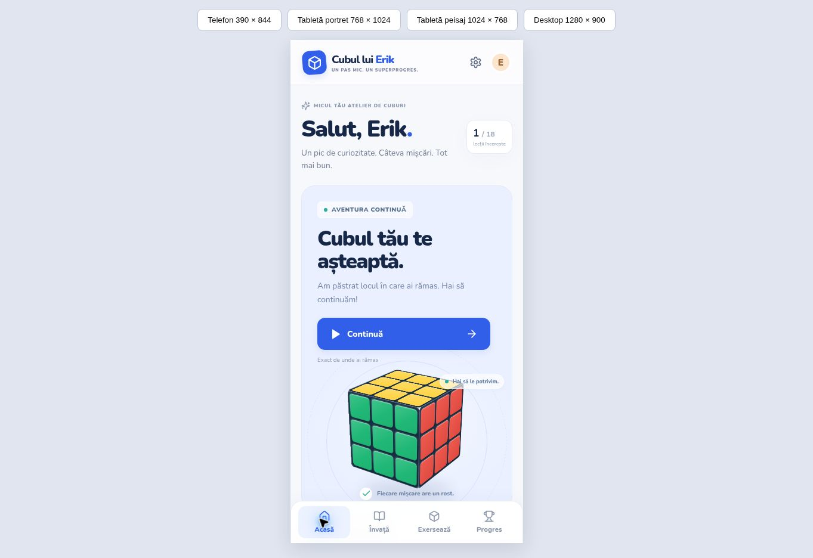
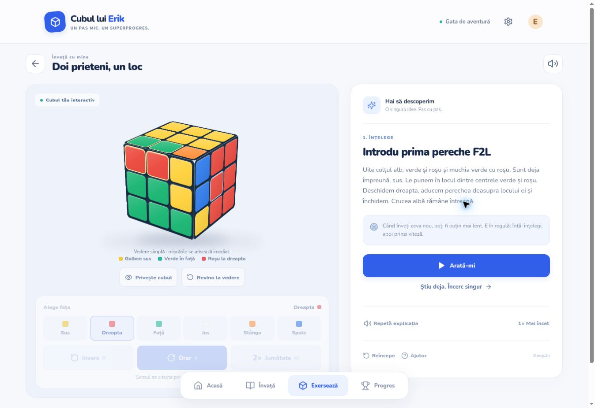
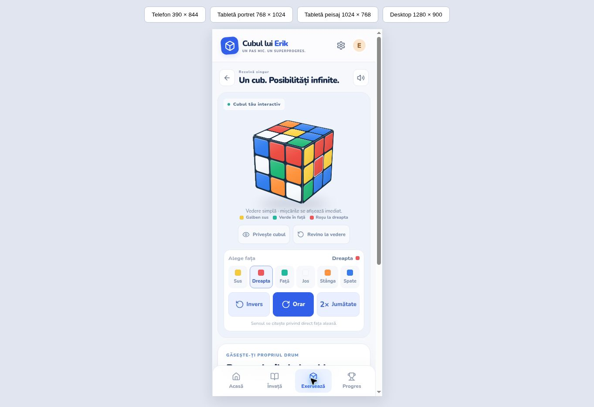
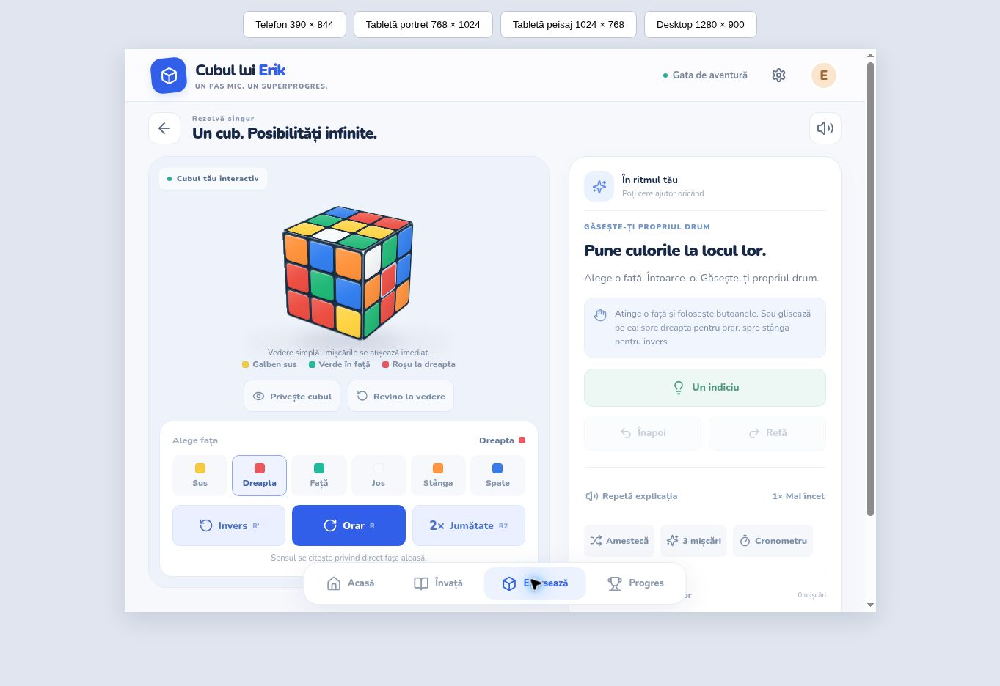
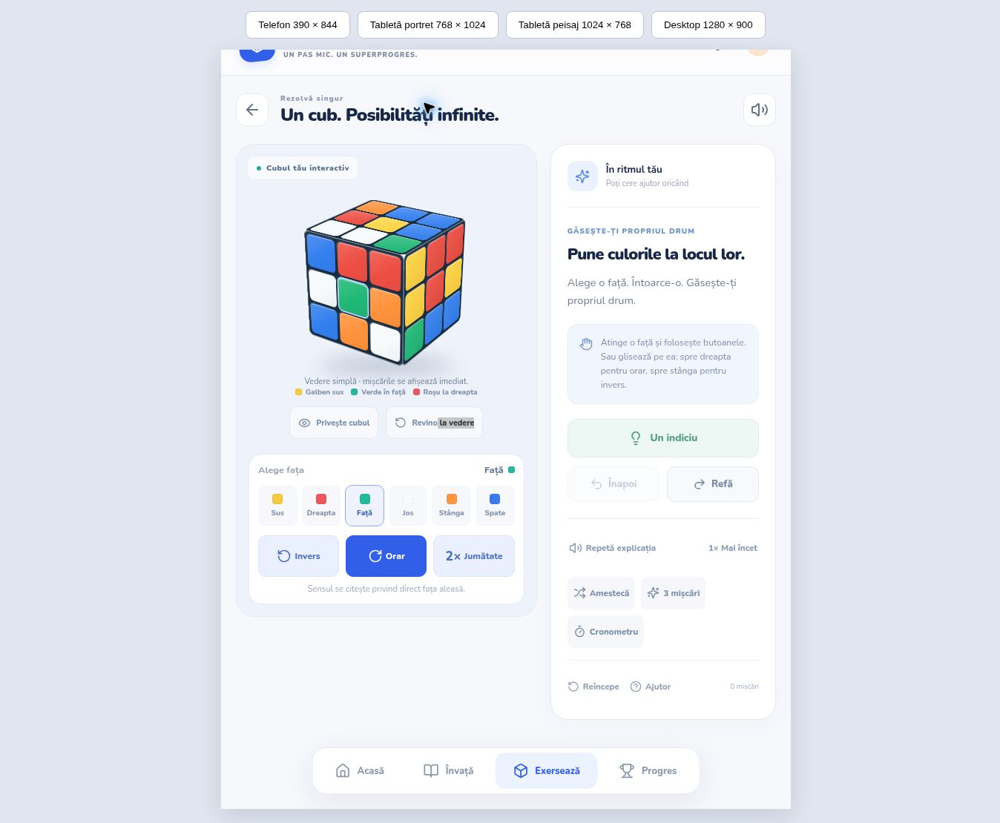
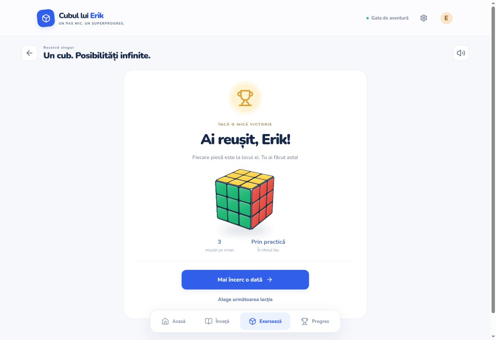
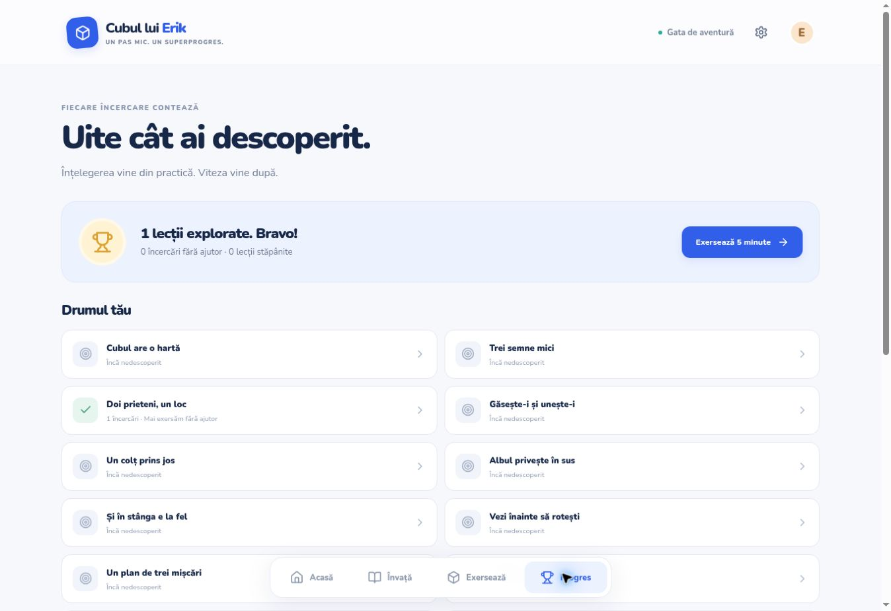
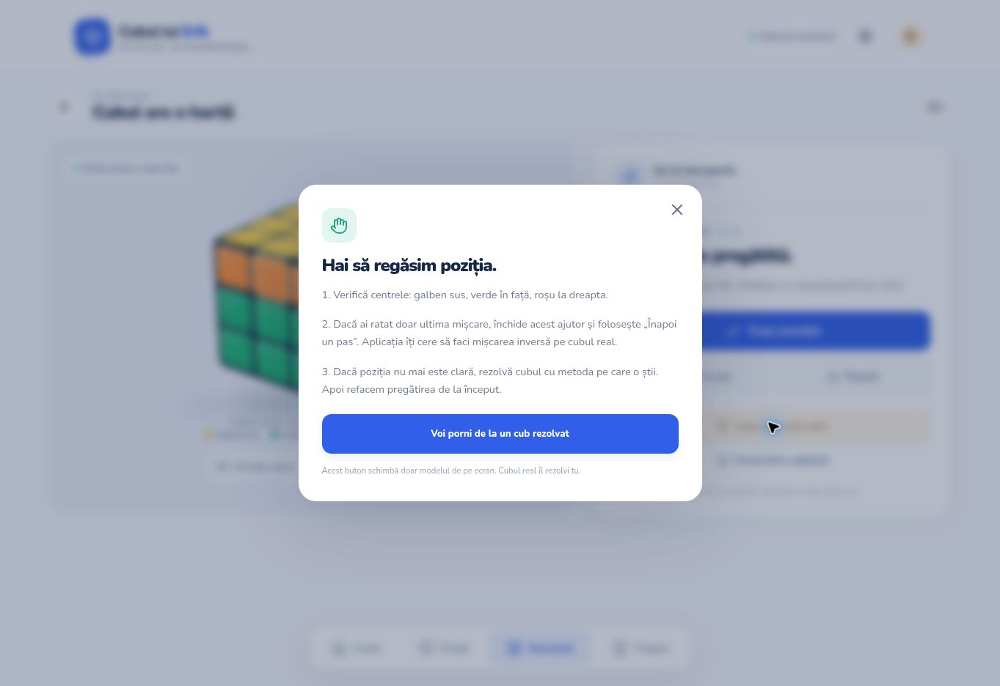

# Screenshots

Actual captures from the public production app. Phone/tablet sizes are CSS iframe viewports in Chrome, not real Apple/Android devices. This browser disables WebGL, so the screenshots show the interactive CSS3D fallback. Test progress shown belongs only to this verification browser.

## Home — desktop

## Home — phone 390×844

## F2L lesson

## Practice — phone

## Practice — landscape tablet 1024×768

## Practice — portrait tablet 768×1024

## Completion

## Progress

## Physical-cube recovery

